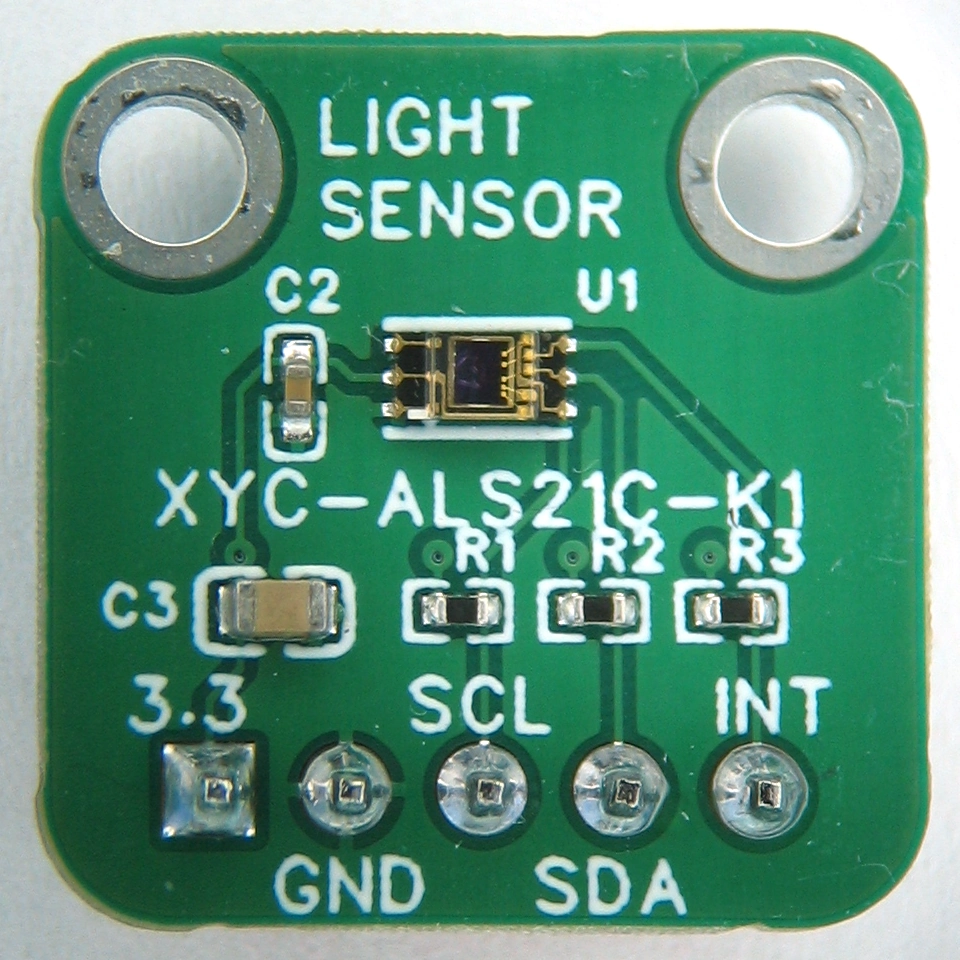
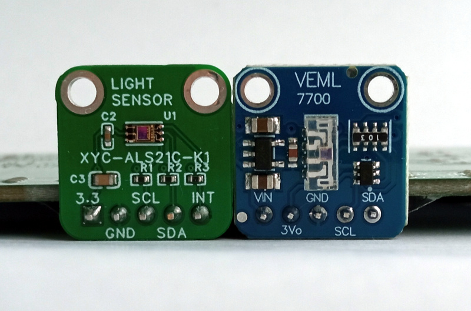

# NEWOPTO XYC-ALS21C-K1 Ambient Light Sensor

This is an Arduino driver for the [NEWOPTO](http://www.xycgd.com/) XYC-ALS21C-K1 Ambient Light Sensor.

## Description

The XYC-ALS21C-K1 is

- digital
- visible light sensor
- I2C
- with an interrupt line
- the size of an 1206 resistor

The driver is written in c/c++. The driver is integer-only, no floating point is used.

## Example programs

Example arduino programs are included:

- [als21c_polling](examples/als21c_polling/als21c_polling.ino) prints light intensity every second

- [als21c_interrupt-driven](examples/als21c_interrupt/als21c_interrupt.ino) prints light intensity when light intensity changes

- [als21c_auto-lux](examples/als21c_auto/als21c_auto.ino) automatically adjusts gain and integration time as needed to obtain a good reading.

- [als21c_compare](examples/als21c_compare/als21c_compare.ino) compares NEWOPTO XYC-ALS21C-K1 and VISHAY VEML7700 using linear regression.
  
  
  
  NEWOPTO XYC-ALS21C-K1 and VISHAY VEML7700 side by side.

## Breakout board

The [breakout board](http://oshwlab.com/koendv/xyc_als21c_k1) is assembled at jlcpcb.

## Reverse mounting

Notes about [reverse mounting the XYC-ALS21C-K1](REVERSE.md)

## Other os

The driver is easily adapter to other operating systems, like [rt-thread](othersrc/README.md)

## See also

This driver may also be of interest for the following similar IC's:

- GOODTAKE [GT442-DALS-Z1](doc/GT442-DALS-Z1.pdf) / GT4421-DALS-Z1
- GOODTAKE [SDF-DALS-Z1-TT/TR](doc/SDF-DALS-Z1.pdf) (same footprint as VEML7700)
- [ALS-AK610P-DF](doc/ALS-AK610P-DF.pdf)
- [WH11867UF](doc/WH11867UF.pdf) 
