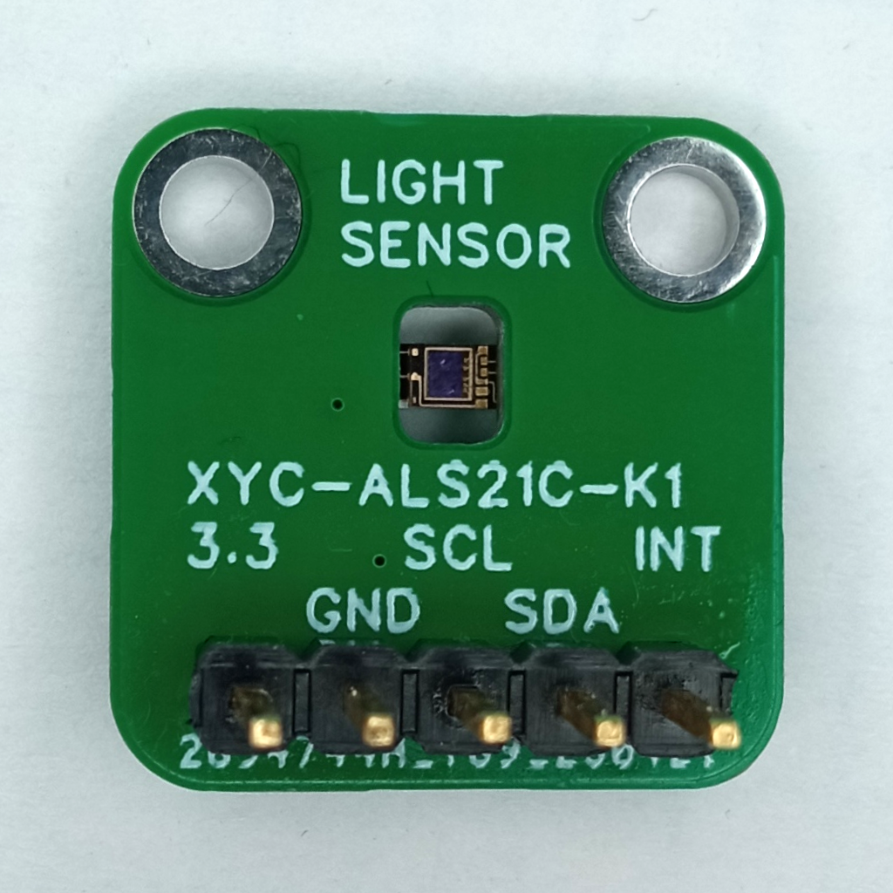
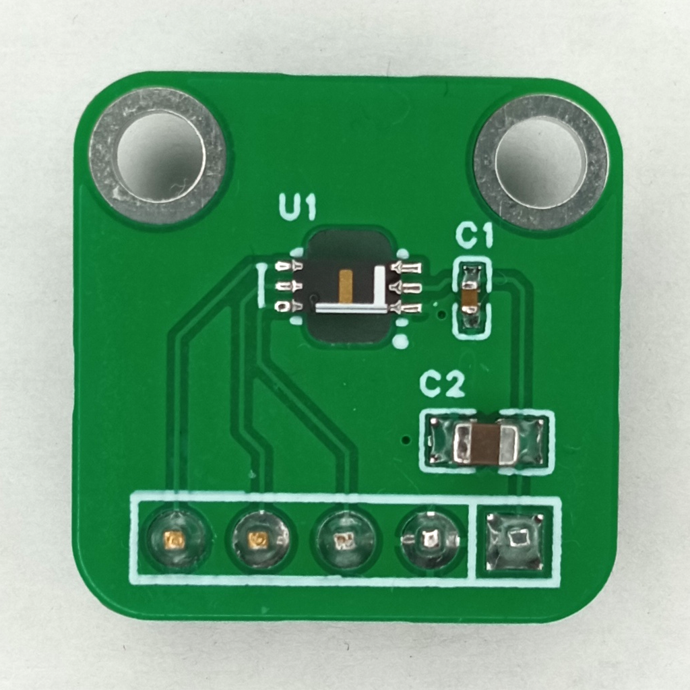

# Reverse mounting NEWOPTO XYC-ALS21C-K1

These are notes about reverse mounting the NEWOPTO XYC-ALS21C-K1 Ambient Light Sensor.

Reverse mounting is soldering an SMD component upside-down over a hole in the pcb. Usually reverse mounting is done with LEDs.

It is possible to reverse mount the XYC-ALS21C-K1. This is interesting on a board with components on one side, and the display on the other side. The ALS21C can then be used to automatically adjust display brightness. There is no need to poll the light sensor, as the ALS21C can raise an interrupt when the ambient light changes.

A small test board has been made:

|  |  |
| ------------------------------------- | ------------------------------------------------------------------- |
| front                                 | back                                                                |

To better see how the sensor is soldered

- open [xyc_als21c_k1_reverse](https://oshwlab.com/koendv/xyc_als21c_k1_reverse)

- click on "Open the design drawing"

- double-click "PCB1"

- open menu "View""

- choose sub-menu "3D Preview"

The 3D model can be rotated and zoomed with the mouse.

Some notes:

The cutout for the reverse mount gives the ALS21C a 50° x 42° field of view.

The ALS21C has an exposed ground pad. Normally the ground pad is soldered to pcb copper, and is used to dissipate heat. In reverse mounting, the exposed ground pad hangs in the air, and cools less. Out of precaution: to keep sensor temperature low, choose a brief measurement time and a  long waiting time between measurements , with `als21c_set_wait_time()`.

The sample board has been soldered by hand.

For automatic placement, SMD re-reeling services exist that accept a component on tape, and make a tape with the component upside-down.  This might be an interesting product.
