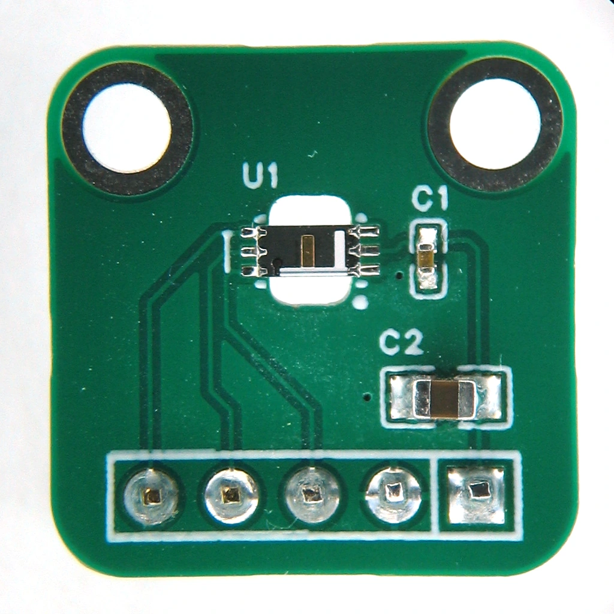
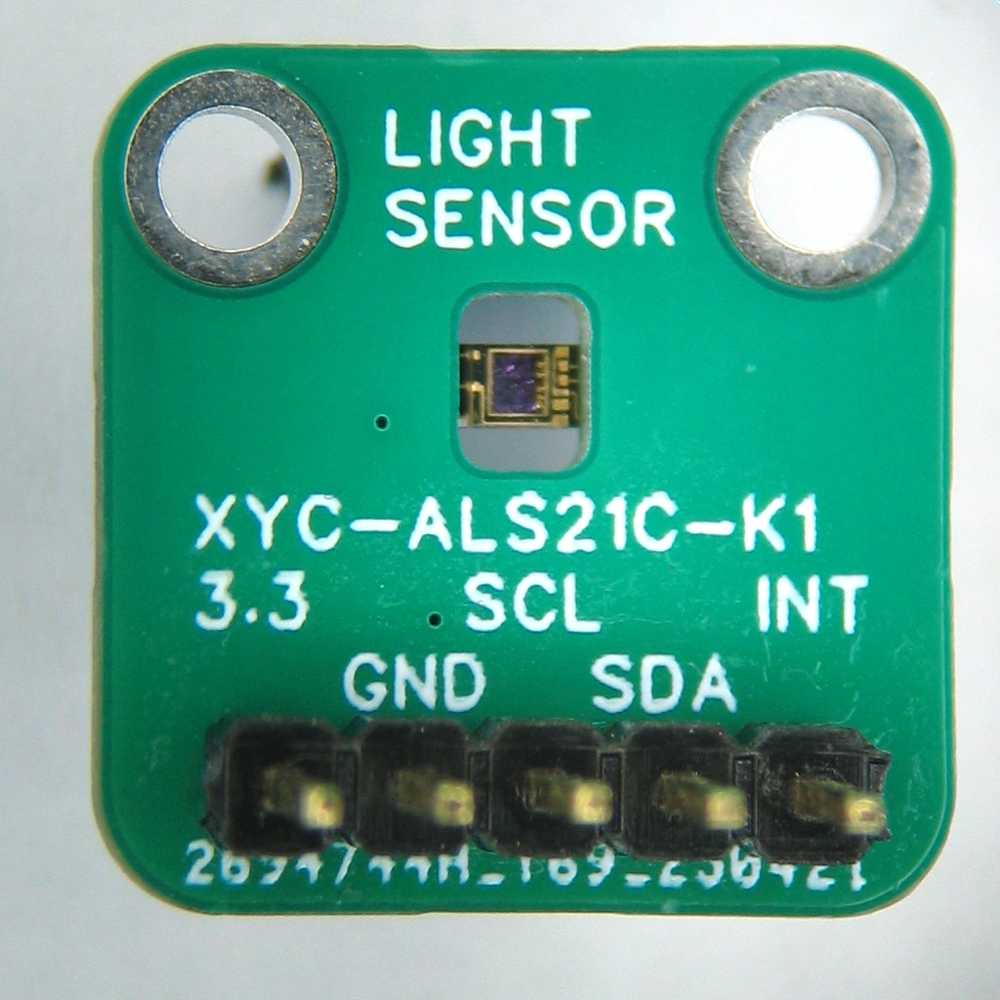

# Reverse mounting NEWOPTO XYC-ALS21C-K1

These are notes about reverse mounting the NEWOPTO XYC-ALS21C-K1 Ambient Light Sensor.

Reverse mounting is soldering an SMD component upside-down over a hole in the pcb.

In automated PCB assembly of a board with only SMD components, the biggest cost saving is keeping the board single-sided, with all components on the same side.
The cost of assembling a double-sided board, with components on both sides, is higher than the cost of assembling a single-sided board with a few components soldered upside-down.

LEDs are readily available for reverse mounting. Visible light sensors not so much.

A small test board has been made to confirm it is possible to reverse mount the XYC-ALS21C-K1.

|  |  |
| ------------------------------------------- | ----------------------------------------- |
| top layer                                   | bottom layer                              |

To better see how the sensor is soldered

- open [xyc_als21c_k1_reverse](https://oshwlab.com/koendv/xyc_als21c_k1_reverse)
- click on "Open the design drawing"
- double-click "PCB1"
- click "3D"

The 3D model can be rotated and zoomed with the mouse.

Some notes:

- The cutout for the reverse mount gives the light sensor a 50° x 42° field of view.
- The ALS21C has an exposed ground pad to dissipate heat. When reverse mounted, the exposed ground pad is not connected to copper, and contributes little to cooling. If temperature is a problem, decrease sensor integration time and increase waiting time between measurements. Use `als21c_set_integration_time()` and `als21c_set_wait_time()`.
- There is no need to poll the light sensor. The light sensor can be programmed to interrupt the processor when the ambient light changes.
- The test board has been soldered by hand.
- For automatic placement, SMD re-reeling services exist that accept a tape-and-reel with components, and make a tape with the components upside-down. This should not be a problem as the XYC-ALS21C-K1 has the same size as an 1206 LED, a common component for reverse mounting.
